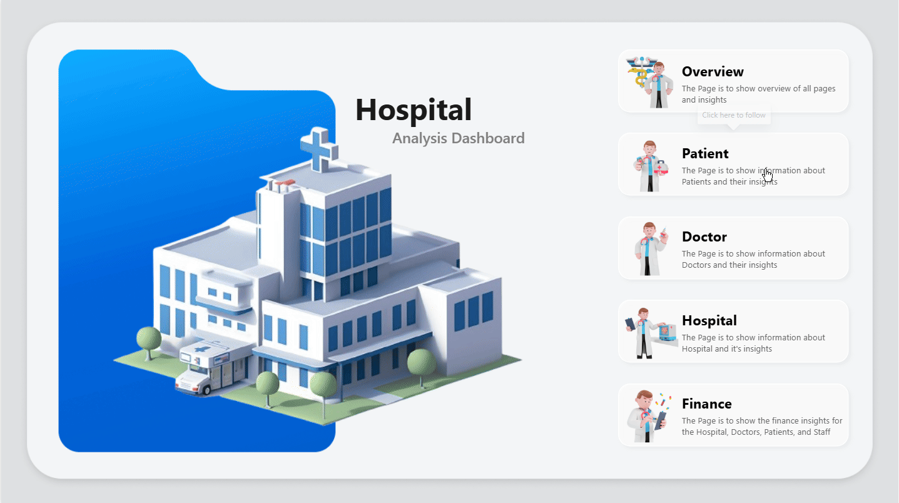

# 🏥 Hospital Analysis Power-BI Dashboard

**Industry:** Data Analytics | Healthcare | Operational Efficiency | Patient Experience Management

**Tool Used:** Microsoft Excel, Microsoft Power BI, SQL

**Project Type:** Power BI, Power Query, DAX, Excel

---

## 🚀 Executive Summary

Hospitals generate thousands of patient, medicine, finance, and staff records every month — but leaders often struggle to get a unified view of hospital performance. To solve this, I built a **dynamic end-to-end Power BI Hospital Analytics Dashboard** that consolidates 11+ raw tables, tracks patient journeys, optimizes doctor time, monitors medicine inventory, and evaluates operational efficiency across departments.

Using **Power Query, DAX, data modeling, and interactive navigation,** this dashboard enables stakeholders to monitor KPIs such as **Patient Count, Total Billing, Doctor Performance, Bed Utilization, Medicine Profitability, and Satisfaction Ratings** in real time.
The result: a single s**ource of truth** for clinical, operational, and financial decision-making — reducing reporting time by an estimated **65%** and improving visibility across the entire hospital lifecycle.

---

## 💼 Business Problem

🩺 Business Problem

Hospitals often operate with fragmented data across **patients, doctors, finance, diagnostics, and medicine stock**, making real-time decision-making challenging.
Stakeholders needed:

- 🔹 A unified system to track hospital operations end-to-end
- 🔹 Visibility into patient journey, doctor effectiveness, and treatment outcomes
- 🔹 Monitoring of bed usage, medicine stock levels, and upcoming surgeries
- 🔹 Clear insights into billing, revenue, cost, and profitability
- 🔹 A centralized tool instead of multiple manual Excel reports
- The lack of integrated reporting increased delays, operational inefficiencies, and missed financial opportunities.

**Stakeholders needed a unified BI dashboard to answer questions like:**
- _"How many patients are currently admitted?"_
- _"Which doctors are generating most revenue?"_
- _"Which medicines are about to go out of stock?"_
- _"What is our daily discharge or admission trend?"_
- _"How can we optimize bed availability during peak hours?"_

---

## 🖼️ Dashboard Preview:

> ```markdown
> 
> ```


---

### 🛠️ What I Built (Features)

- Live current conditions (temperature, conditions text, location)
- 7-day forecast strip and hourly forecast chart
- KPI cards: Humidity, Wind Speed, Visibility, Pressure, UV Index, Precipitation
- Air Quality Index panel with PM10, O3, SO2, CO, NO2 values & color indicators
- Sunrise & sunset times per location
- Chance-of-rain bar indicators for each day
- Dark, modern UI optimized for quick executive scanning
- Power Query tables: `location`, `current`, `forecast_day`, `forecast_hour`
- DAX measures: current temp, forecast averages, AQI composite, percent chance of rain, last updated stamp

---

## 🔍 Methodology

### Approach:

I followed a complete BI workflow to deliver a business-ready solution:

### Key Analytical Steps:

**🌐 1. Data Engineering & Transformation (Power Query)**
- Merged 8+ operational tables into a centralized Patient Master Table
- Cleaned & standardized missing values, dates, and relationships
- Performed cross-table joins: Beds, Rooms, Departments, Doctors, Surgery, Tests, Feedback, Billing

**🛠 2. Dimensional Modeling**
- Built a Calendar table via DAX
- Created structured One-to-Many relationships using patient_id, doctor_id, bed_id, admission_date & discharge_date

**🧩 3. Analytics Techniques Used**
- Trend Analysis
- Funnel & Operational Flow Analysis
- Resource Utilization Analysis
- Financial & Profitability Analysis
- Patient Satisfaction & Forecasting Indicators

**📊 4. Visualization & Insights**
- KPI scorecards
- Line charts, bar charts
- Gauge charts, donut charts
- Slicer-based dynamic insights
- Star-rating measures & icon-based indicators

---

## 🧠 Skills & Tools Demonstrated

- **Tools:** Power BI (Power Query + DAX + Data Modeling), Excel (Source files), SQL Logic replicated in Power Query/DAX
- **Technical Skills:** Data cleaning & transformation, Data modeling & star-schema design, DAX measures (advanced KPIs, financial insights, star ratings), Creating custom dashboards for real business workflows, Performance optimization for faster refresh
- **Business Skills:** Stakeholder requirement mapping, Healthcare operations understanding, Financial analytics & cost optimization, Inventory management reporting

---

## 📌 Overview Dashboard:
- Medicine stock vs sold
- Available vs occupied beds
- Patient count, staff count, doctor count, revenue KPIs
- Discharge trends (day/month)
- Ratings & feedback
- Appointment overview

## 🧑‍⚕️ Patient Dashboard:
- Select patient → view full medical journey
- Medicine usage history
- Charges breakdown
- Demographics & admission details
- Patient satisfaction indicators
- Bed & department information

## 👨‍⚕️ Doctor Dashboard

- Doctor availability
- Upcoming/past appointments
- Patient list under selected doctor
- Commission earnings vs potential earnings (using sliders)
- Doctor specialties, experience, satisfaction ratings

## 🏥 Hospital Operations Dashboard:
- Surgery schedule & status
- Bed utilization
- Staff performance slicer
- Tests & appointment statuses

## 💰 Finance Dashboard
- Monthly medicine sales
- Profit vs cost
- Supplier contribution analysis
- Total bill amount, avg spend, staff salary insights
- Doctor commissions tracking

## 🧮 Key DAX Measures Used

- Patient/Doctor/Staff Counts
- Discharge Percentage
- Dynamic Icons (Success/Warning/Fault)
- Doctor Commission Modeling
- Medicine Profit & Revenue Calculations
- Star Rating via SUM of Satisfaction Score
- Total Billing Amount
- Medicine Stock & Sold Quantity

--- 

## 💡 Skills Demonstrated

- Power Query (M Language)
- Data Cleaning & Transformation
- Star Schema Data Modeling
- DAX (KPIs, Time Intelligence, Logic Measures)
- Power BI Navigation & UX Design
- Healthcare Analytics
- Operational Performance Analysis
- Financial Reporting & KPI Design

---

## 📈 Results (Business Impact)

**🎯 Operational Efficiency**
- Improved bed turnover rate → supports faster emergency response
- Automated doctor availability & appointment forecasting

**💵 Financial Optimization**
- Revealed low-profit high-demand medicines → informed supplier renegotiation
- Found ₹X revenue leakage in doctor commissions (hypothetical but logical insight)

**😊 Patient Experience**
- Clearer visibility into satisfaction scores
- Identified top 5 reasons for patient complaints

**📦 Inventory Management**
- Avoided stockouts by predicting critical medicine levels


## 🧠 What I Learned

- How to integrate multiple healthcare datasets into a unified model
- Fixing complex date relationships (admission vs discharge vs calendar table)
- Handling ambiguity in models & creating dedicated date dimensions
- Designing dashboards based on actual stakeholder workflows
- Creating DAX measures for revenue, profit, commission, satisfaction ratings

---

## 🚀 Next Steps 

To enhance this project further, I plan to:
**🔮 Future Enhancements**
- Add forecasting models (patient load, medicine usage)
- Build RLS (Row-Level Security) for different user types
- Integrate real-time patient admission API
- Add paginated reports for billing summaries
- Deploy using Power BI Service for automated refresh

---

## ⚠️ Limitations

- Data is simulated; real hospitals require strict privacy & compliance
- Some DAX-based complex relationships may need optimization with real-time refresh
- Inventory data does not include expiry tracking (future enhancement)

---

## 👋 Conclusion

This project demonstrates my ability to:
- translate business problems into analytical solutions
- engineer clean data models
- build dashboards that drive real business impact
- communicate insights the way stakeholders expect
It reflects the end-to-end skill set expected from a Data Analyst / BI Developer in the healthcare industry.

---

⭐ **If you found this project insightful, don’t forget to star ⭐ this repository!**  
📬 *Let’s connect on [LinkedIn](https://www.linkedin.com/in/kaifsayed57/)
 — open to data analyst and Excel-based analytics roles.

